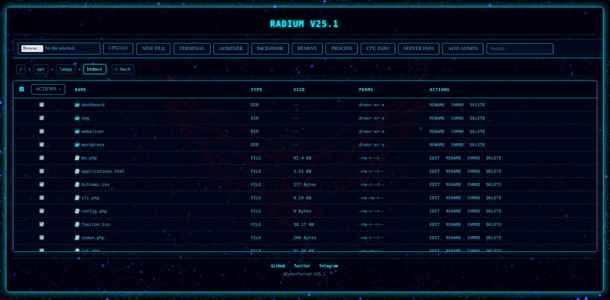
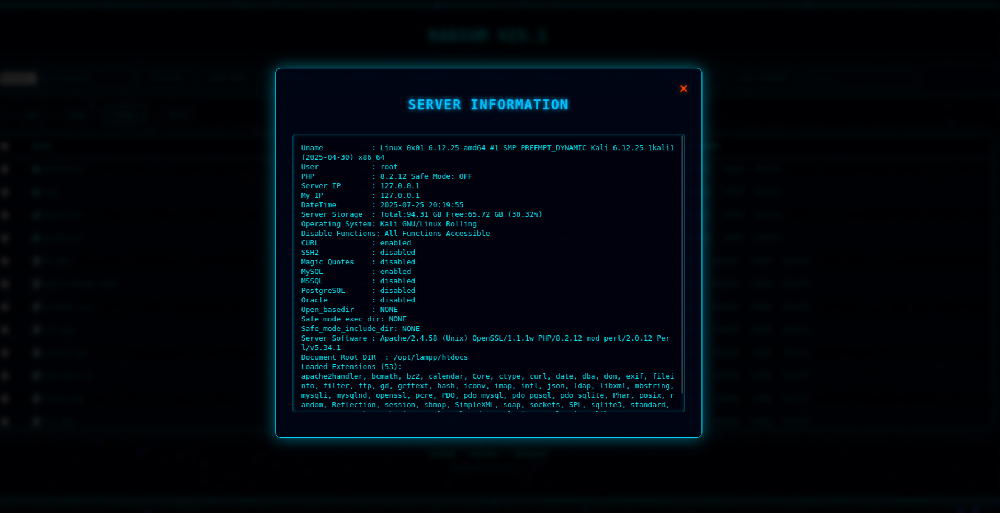
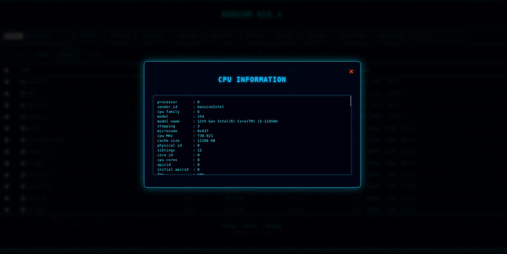
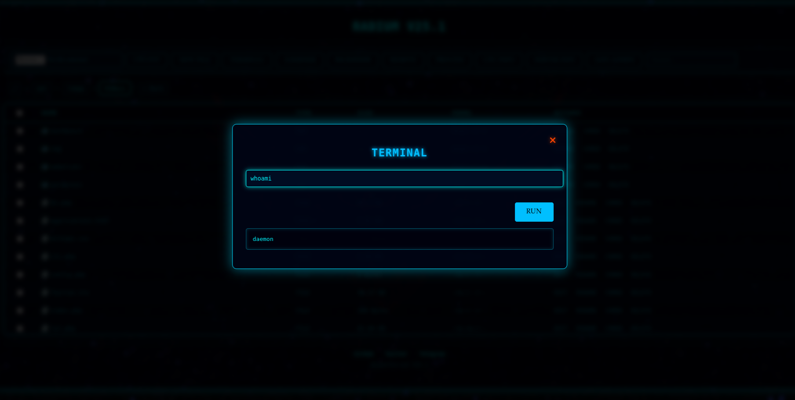
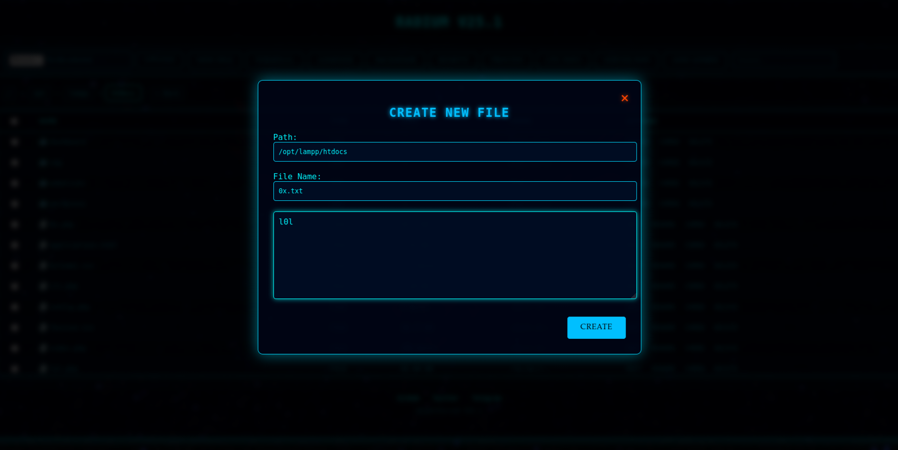
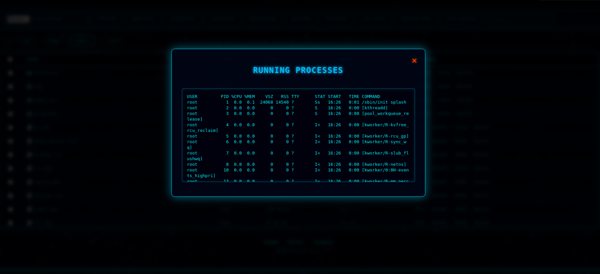
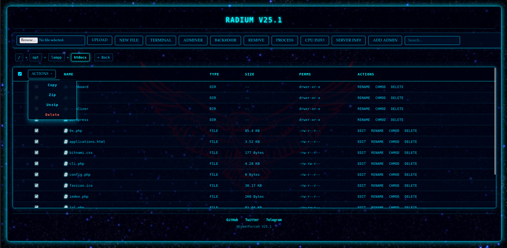

# ⚛️ Radium Shell

---
**Radium** is a Web Based PHP Shell designed for Advanced Server Management. It Provides a Rich Interface For Interacting With A Server File System.
---

## Features

| Module             | Description                                                                 |
|--------------------|-----------------------------------------------------------------------------|
| File Manager     | Copy, move, delete, rename, edit, and change file permissions              |
| Compression      | ZIP and UNZIP file and folder                                    |
| CMD Interface     | Execute shell commands and receive real-time output                        |
| Adminer          | Embedded Adminer (MySQL database manager)                      |
| CPU Info         | View CPU usage, model, cores, and threads                         |
| Server Info      | Server IP, OS details, disk usage, PHP version              |
| File Creator     | Create new files.                                                  |
| Add Admin        | Add new admin account to common CMS systems (Now only available for WordPress)      |
| Backdoor Uploader| Upload persistent backdoors (reverse shell)              |
| Auto Recovery    | Auto-download on server and silently inject in server              (Soon)             |
| Credential Harvester | Scan for and collect stored credentials (Soon) |

---

## 📸 Screenshots

**
### Filemanager

Upload Files, Edit Files, Set Permissions,Delete.

### Server Info

Displays Server Information.

### CPU Info

Displays CPU model, core/thread usage.

### Terminal Page

Run shell commands & real-time outputs.

### File Creator

Create new files.

### Processing

Display Information About Runing Applications in Background.

### Bulk

Bulk Deletion/Copy/Zip/Unzip.

---

> 🔒 **DISCLAIMER**  
Clean&Clear Warnning This project is intended **solely for authorized penetration testing purposes**.
